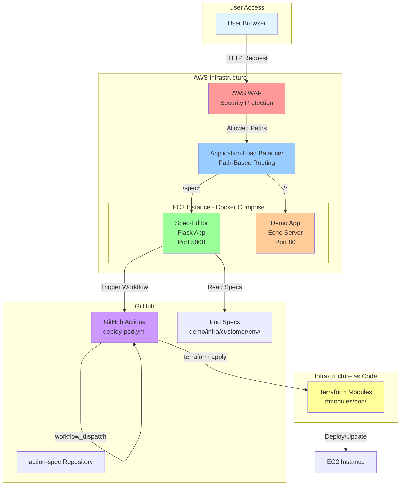
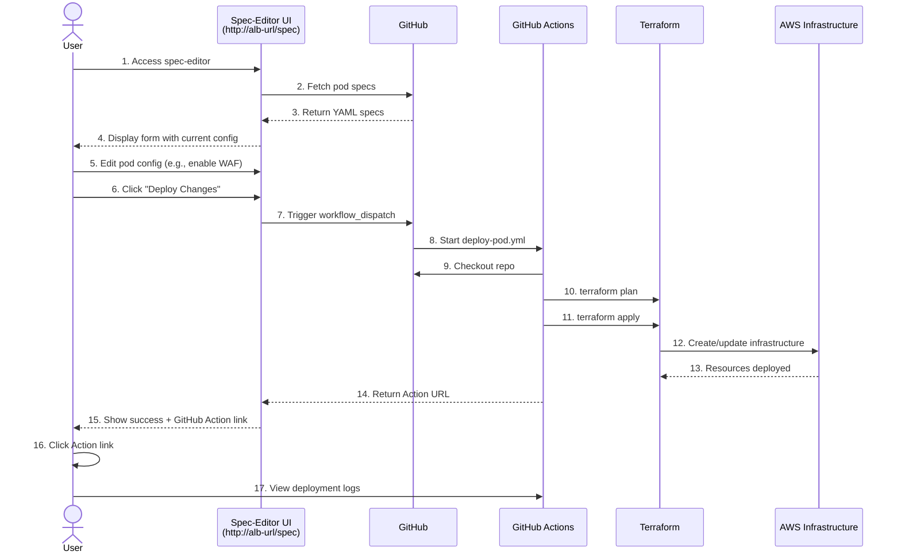

# ActionSpec Demo - Infrastructure Deployment via Spec Editor

A proof-of-concept demonstration of YAML-driven infrastructure deployment with a web-based specification editor. This demo showcases how declarative specifications can drive automated AWS infrastructure deployment through GitHub Actions workflows.

**Key Technologies**: Flask (Python), Terraform, AWS (ALB, WAF, EC2), Docker, GitHub Actions

## What This Demo Shows

- **YAML specifications drive infrastructure deployment** - Edit specs via web UI, trigger deployments automatically
- **Web UI for managing pod configurations** - Form-based editor for infrastructure specifications
- **GitHub Actions automation** - Workflow dispatch integration for deployment triggers
- **AWS WAF security integration** - Path-based filtering and rate limiting rules
- **Path-based ALB routing** - Multiple services behind a single load balancer (`/spec` → editor, `/` → demo app)
- **Complete GitOps workflow** - Changes committed to repo, deployed via IaC (Terraform)

## Architecture

### System Overview



### Component Details

**Spec-Editor** (Flask app, port 5000)
- Web UI for viewing and editing pod specifications
- GitHub API integration for spec storage and retrieval
- Workflow dispatch capability for triggering deployments
- Form-based interface with validation

**Demo App** (Echo server, port 80)
- Simple application demonstrating deployed workload
- Shows request/response details for testing
- Validates ALB routing is working

**ALB Routing**
- `/spec` and `/spec/*` → Spec-editor UI
- `/` and all other paths → Demo application
- Health checks on both target groups

**WAF Protection**
- Path filtering rules (only `/spec`, `/health`, `/api/v1/*` allowed initially)
- Rate limiting (10 requests per 5 minutes per IP)
- OWASP Top 10 managed rule groups
- Custom rules for common attack patterns

## Running Locally

### Prerequisites

- Docker and Docker Compose installed
- GitHub personal access token with `repo` and `actions:write` scopes
- Git configured with user.name and user.email

### Environment Setup

1. Clone the repository:
```bash
git clone https://github.com/yourusername/action-spec.git
cd action-spec/demo
```

2. Create `.env` file with required variables:
```bash
# GitHub Configuration
GITHUB_TOKEN=ghp_your_token_here
GITHUB_OWNER=yourusername
GITHUB_REPO=action-spec
WORKFLOW_BRANCH=feature/demo-phase-d8  # or your branch name

# Flask Configuration
FLASK_ENV=development
FLASK_DEBUG=1
```

3. Start the services:
```bash
docker compose up
```

4. Access the services:
- **Spec-Editor UI**: http://localhost:5000
- **Demo App**: http://localhost:80

### Local Development Tips

- Spec-editor mounts `demo/infra/` for live spec editing
- Changes to Flask code require container restart
- Logs visible via `docker compose logs -f spec-editor`

## Deployment to AWS

### Terraform Infrastructure Overview

The demo uses a "pod" infrastructure pattern where each pod is a self-contained deployment unit:

```
demo/infra/
└── {customer}/          # Customer/organization name (e.g., advworks)
    └── {environment}/   # Environment (dev, staging, prod)
        ├── spec.yml     # Pod specification (what to deploy)
        └── terraform/   # Generated Terraform configs (managed by workflow)
```

### Pod Structure

Each pod has a `spec.yml` file defining:
- **Instance configuration**: type, AMI, key pair
- **Networking**: VPC, subnets, security groups
- **Features**: WAF enabled/disabled, ALB settings
- **Application**: Docker image, environment variables

Example `spec.yml`:
```yaml
pod:
  customer: advworks
  environment: dev
  instance:
    type: t4g.nano
    ami: ami-0c55b159cbfafe1f0
  networking:
    vpc_id: vpc-12345
    subnet_ids:
      - subnet-abc123
  features:
    waf_enabled: true
    alb_enabled: true
```

### GitHub Actions Workflow

The `deploy-pod.yml` workflow:
1. Triggered via workflow_dispatch (from spec-editor UI or manually)
2. Validates pod specification
3. Runs `terraform plan` to preview changes
4. Applies infrastructure changes via `terraform apply`
5. Commits updated state back to repository
6. Returns deployment status and Action URL

**Trigger from UI**: Click "Deploy Changes" button in spec-editor
**Trigger manually**: GitHub UI → Actions tab → deploy-pod → Run workflow

## Demo Flow

### Deployment Sequence



### Step-by-Step Walkthrough

1. **Access spec-editor**: Navigate to `http://<alb-url>/spec`
2. **Select pod**: Choose customer and environment (e.g., advworks/dev)
3. **View current configuration**: Form displays current spec.yml values
4. **Make changes**:
   - Change instance name
   - Enable/disable WAF
   - Modify instance type
5. **Deploy changes**: Click "Deploy Changes" button
6. **Deployment triggers**: GitHub Action starts automatically
7. **View progress**: Click the returned Action URL to watch logs
8. **Verify deployment**: Check AWS Console for infrastructure changes
9. **Test demo app**: Visit `http://<alb-url>/` to see deployed application
10. **Test WAF**: Try blocked paths (e.g., `/admin`) to verify security rules

## Components

**Backend Application**
- `demo/backend/` - Flask spec-editor application
  - `app.py` - Main application entry point
  - `templates/` - Jinja2 HTML templates
  - `static/` - CSS and client-side assets

**Infrastructure Specifications**
- `demo/infra/` - Pod specifications organized by customer/environment
  - Currently contains: advworks/dev, contoso/staging, fabrikam/prod

**Terraform Modules**
- `demo/tfmodules/pod/` - Reusable Terraform module for pod deployment
  - Manages EC2, ALB, WAF, security groups, IAM roles

**Development Environment**
- `demo/docker-compose.yml` - Local development setup
- `demo/Dockerfile` - Container image for spec-editor
- `demo/justfile` - Task runner with useful commands

**GitHub Workflows**
- `.github/workflows/deploy-pod.yml` - Pod deployment automation
- `.github/workflows/terraform-plan.yml` - Preview infrastructure changes
- `.github/workflows/terraform-apply.yml` - Apply infrastructure changes

## Testing the Demo

### WAF Testing Commands

The `justfile` provides convenient commands for testing WAF rules:

```bash
# Test path-based filtering (tests allowed and blocked paths)
just waf-test-paths http://your-alb-url.amazonaws.com

# Test rate limiting (fires 200 requests to trigger rate limits)
just waf-test-rate http://your-alb-url.amazonaws.com

# Run all WAF tests
just waf-test-all http://your-alb-url.amazonaws.com
```

### Expected Results

**Allowed Paths** (should return 200 OK):
- `/spec` - Spec-editor UI
- `/spec/pod/advworks/dev` - Pod form
- `/health` - Health check endpoint
- `/api/v1/pods` - API endpoints
- `/` - Demo application

**Blocked Paths** (should return 403 Forbidden):
- `/admin` - Admin panel (common attack target)
- `/malicious` - Explicitly blocked pattern
- `/../../etc/passwd` - Path traversal attempt
- `.php`, `.asp` files - Disallowed file extensions

**Rate Limiting**:
- First ~10 requests from same IP succeed (200 OK)
- Subsequent requests blocked (403 Forbidden)
- Rate limit resets after 5 minutes

### Manual Testing

Test ALB routing:
```bash
# Should show spec-editor UI
curl -i http://<alb-url>/spec

# Should show demo app
curl -i http://<alb-url>/

# Should be blocked by WAF
curl -i http://<alb-url>/admin
```

Test workflow dispatch:
```bash
# Trigger deployment via API (requires GitHub token)
curl -X POST \
  -H "Authorization: token $GITHUB_TOKEN" \
  -H "Accept: application/vnd.github.v3+json" \
  https://api.github.com/repos/OWNER/REPO/actions/workflows/deploy-pod.yml/dispatches \
  -d '{"ref":"main","inputs":{"customer":"advworks","environment":"dev"}}'
```

## Limitations (Demo Scope)

This is a proof-of-concept demo with intentional limitations:

**Security Constraints**:
- ❌ No user authentication (single-tenant demo)
- ❌ GitHub token stored in environment (not secrets manager)
- ❌ No HTTPS in local development
- ⚠️ Wide-open security groups (demo only - not production ready)

**Functionality Constraints**:
- ❌ No delete functionality (safety measure - creates and updates only)
- ❌ Limited to 3 customers (hardcoded in spec.yml structure)
- ❌ No rollback capability (manual revert via Git required)
- ❌ No deployment history or audit log
- ❌ No concurrent deployment protection

**Cost Optimization**:
- Uses t4g.nano instances (cost-optimized, not performance-optimized)
- No auto-scaling (single instance per pod)
- No multi-region deployment

**Data Persistence**:
- Specs stored in Git (no database)
- No backup/restore functionality
- No config drift detection

**Production Readiness**:
- This is a demo POC, not production-grade infrastructure
- See parent `README.md` for enterprise solution roadmap
- Missing: monitoring, alerting, disaster recovery, compliance controls

## Next Steps

**For Local Development**:
1. Explore the spec-editor UI at http://localhost:5000
2. Review pod specifications in `demo/infra/`
3. Make changes and observe workflow triggers
4. Review Terraform modules in `demo/tfmodules/`

**For AWS Deployment**:
1. Configure AWS credentials in GitHub Secrets
2. Update pod specifications with your AWS resource IDs
3. Trigger deployment via spec-editor or GitHub Actions
4. Monitor deployment via Action logs
5. Test WAF rules using justfile commands

**For Contributing**:
1. See parent repository `CONTRIBUTING.md` (if exists)
2. Follow commit message conventions (conventional commits)
3. Test locally before deploying to AWS
4. Document any new features or changes

## Troubleshooting

**Issue**: Spec-editor shows "Failed to fetch pods"
- **Solution**: Check `GITHUB_TOKEN` is set in `.env` and has `repo` scope

**Issue**: Docker compose fails to start
- **Solution**: Check ports 5000 and 80 are not in use (`lsof -i :5000`)

**Issue**: Deployment workflow fails
- **Solution**: Check Action logs in GitHub UI, verify AWS credentials and permissions

**Issue**: WAF blocks spec-editor access
- **Solution**: Verify ALB rules allow `/spec` path, check WAF rules in AWS Console

**Issue**: Changes not reflected after deployment
- **Solution**: Check Git branch matches `WORKFLOW_BRANCH` in `.env`, verify workflow completed successfully

## Additional Resources

- **Parent Project**: See `../README.md` for overall project goals and architecture
- **Enterprise PRD**: See `../PRD.md` for planned enterprise features
- **Terraform Docs**: [Terraform AWS Provider](https://registry.terraform.io/providers/hashicorp/aws/latest/docs)
- **GitHub Actions**: [Workflow Syntax](https://docs.github.com/en/actions/using-workflows/workflow-syntax-for-github-actions)
- **AWS WAF**: [WAF Developer Guide](https://docs.aws.amazon.com/waf/latest/developerguide/)

---

**Version**: v0.1.0 (Alpha POC)
**Maintained by**: ActionSpec Demo Team
**License**: See parent repository LICENSE file
